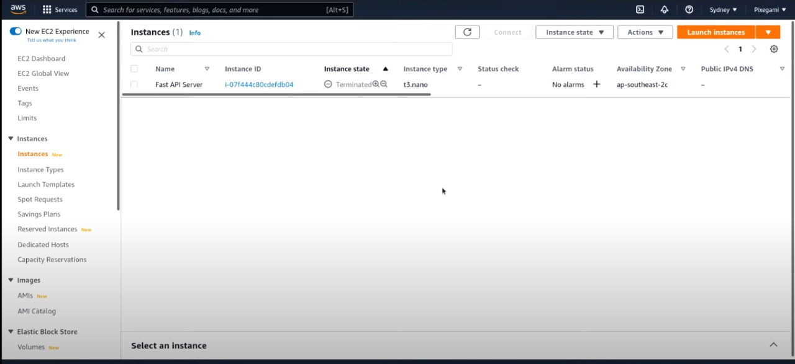
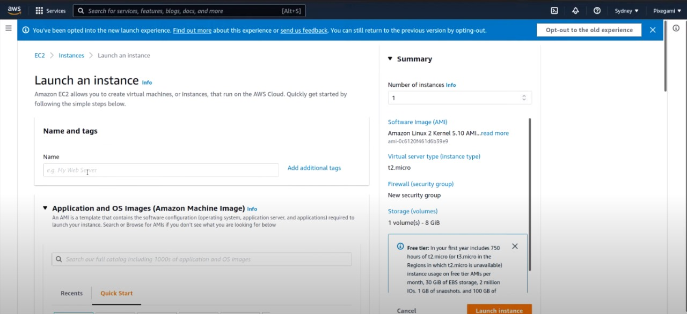
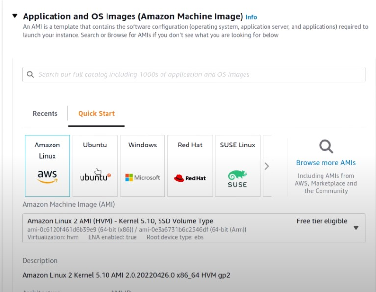
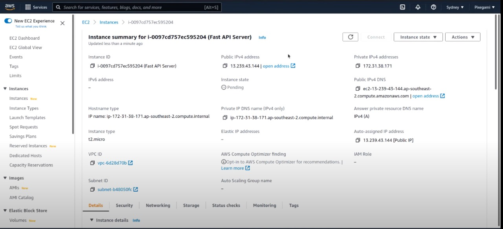
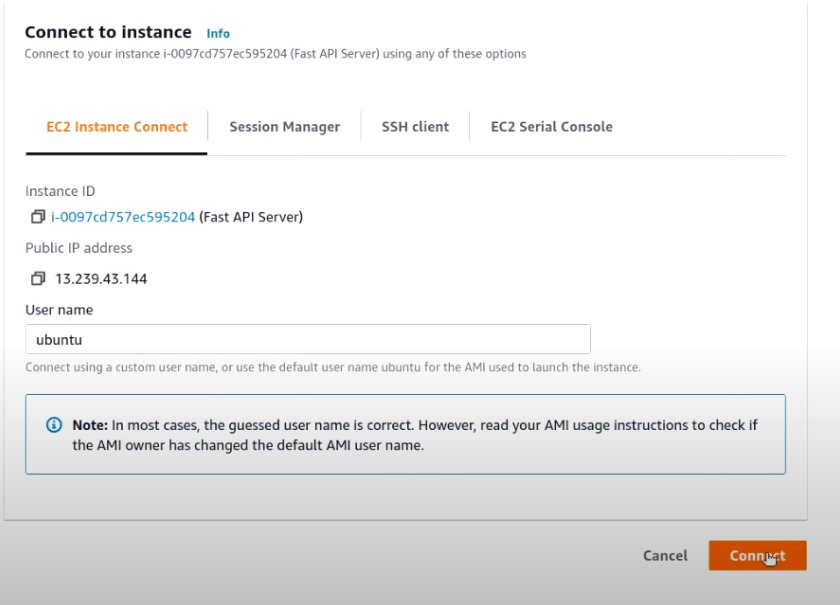
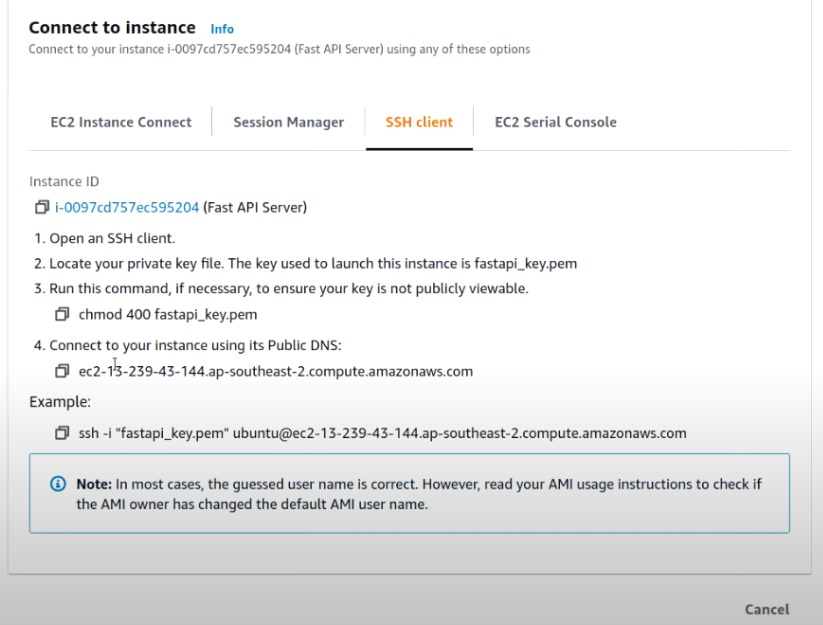

# Procedure to host Fast API on AWS.

## Step 1

- login to your AWS account and go to Console.


## Step 2

- Go to ec2 dashboabrd and click on launch instance.



## Step 3

### Step 3.1

- Create an instance


### Step 3.2

- Choose an application and Os images



### Step 3.3

- Choose an instance type


### Step 3.4

- Create a Key pair


- Key appears in the form of .pem file. Download it and keep it safe. It will be used to connect to the instance.

## Step 4

- Network Setting


- Launch the instance.
- Click on the instance ID to see the details of the instance.



## Step 5

- Connect to the instance.



### Step 5.1

- To connect to the instance via SSH client



### Step 5.2

- Go to the directory where the .pem file is stored and run the following command to change the mod 400

```bash
chmod 400 file_name.pem
```

### Step 5.3

- Copy the SSH command and run it in the terminal.


### Step 5.4

- After succesful connection, Update the system.

- Download depenedencies and install them.

```bash
Sudo apt install -y python3-pip nginx
```

Note: Nginx is used to host the Fast API on the server. It is a web server that can be used to host the Fast API. Load balancer can also be used to host the Fast API.

### Step 5.5

- Create a Nginx configuration file.

```bash
sudo vim /etc/nginx/sites-enabled/fastapi_ngnix
```

### Step 5.6

- Create a server block in the configuration file.

```bash
server {
    listen 80;
    server_name _(public ipv4 of the instance)_;
    location / {
        proxy_pass http://127.0.0.1:8000;
    }
}
```


### Step 5.7

- Restart the Nginx server.

```bash
sudo service nginx restart
```

### Step 5.8

- Git clone your Repository to the instance machine.


### Step 5.9

- Set up your project. install all dependencies and run the python server with the following command.

```bash
python3 -m uvicorn file_name:app --host
```

# References
- https://www.youtube.com/watch?v=SgSnz7kW-Ko
